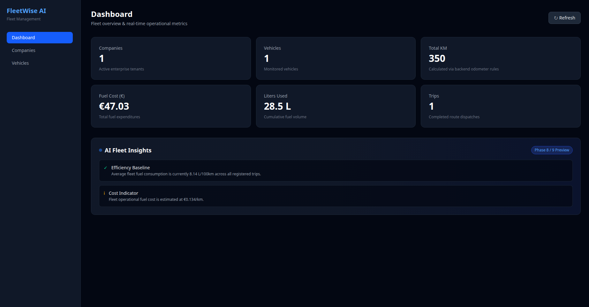
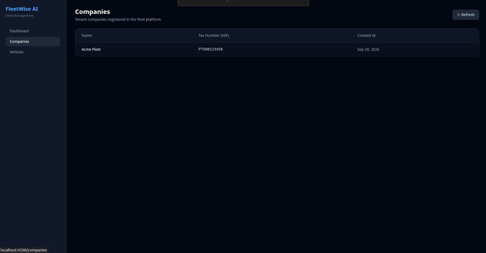
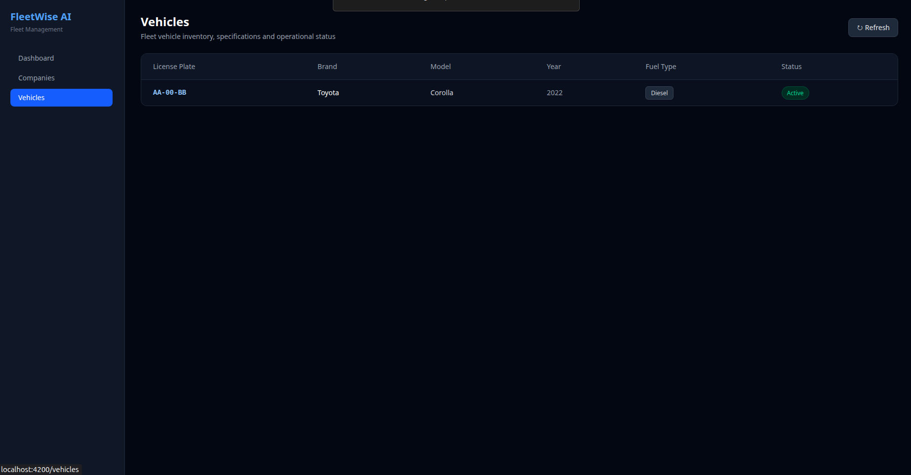

# FleetWise AI

Fleet management platform that centralises vehicle, trip, fuel and expense data and uses AI to help managers identify cost drivers and anomalies.

> Portfolio project focused on demonstrating **how AI assists software development**  
> (time savings, architecture decisions, clean domain design).

## Screenshots

### Dashboard

### Companies

### Vehicles

---

## Stack

| Layer                  | Technology                                               |
|------------------------|----------------------------------------------------------|
| Language               | Java 21                                                  |
| Framework              | Spring Boot 3.4                                          |
| API                    | Spring Web (REST)                                        |
| Persistence            | Spring Data JPA + Hibernate                              |
| Validation             | Bean Validation                                          |
| Security               | Spring Security (open in Phase 1; Entra ID later)        |
| Frontend               | Angular (Standalone Components + Signals) + Tailwind CSS |
| Database (local)       | PostgreSQL 16                                            |
| Database (prod target) | Azure SQL                                                |
| Build                  | Maven                                                    |

## Project structure (feature / domain oriented)

com.fleetwise
├── common
│   ├── config          SecurityConfig
│   └── exception       ResourceNotFound, BusinessRule, GlobalExceptionHandler
├── company
├── vehicle
├── driver
├── trip
├── fueling
├── expense
├── maintenance
└── analytics

## Key engineering decisions

1. **Distance is calculated on the backend**  
   `distance = endMileage - startMileage`. Prevents tampering and keeps the business rule in one place.

2. **Fuel total cost is calculated on the backend**  
   `totalCost = liters × pricePerLiter` (scale 2, HALF_UP).

3. **DTOs + Bean Validation**  
   Entities are never exposed. Requests are validated before reaching the service layer.

4. **RFC 7807 ProblemDetail**  
   Consistent error responses for 404, 422 (business rules) and 400 (validation).

5. **Feature packages**  
   Ready for analytics, AI and reporting without restructuring.

## API overview

| Resource     | Base path                |
|--------------|--------------------------|
| Companies    | `/api/v1/companies`      |
| Vehicles     | `/api/v1/vehicles`       |
| Drivers      | `/api/v1/drivers`        |
| Trips        | `/api/v1/trips`          |
| Fuelings     | `/api/v1/fuelings`       |
| Expenses     | `/api/v1/expenses`       |
| Maintenances | `/api/v1/maintenances`   |
| Analytics    | `/api/v1/analytics`      |

All support standard CRUD. List endpoints accept optional filters (`companyId`, `vehicleId`).

---

## Roadmap

| Phase | Scope                                                       | Status   |
|-------|-------------------------------------------------------------|----------|
| 0     | Product definition                                          | Done     |
| 1     | Database + domain model                                     | **Done** |
| 2     | Spring Boot REST API + business rules                       | **Done** |
| 3     | Analytics (consumption, cost/km, variation, anomaly rules)  | **Done** |
| 4     | Angular dashboard (KPIs, tables, Signals, Tailwind)         | **Done** |
| 5     | Authentication (JWT / Entra ID + RBAC)                      | Next     |
| 6     | Azure deployment                                            | Planned  |
| 7     | Blob Storage + document extraction                          | Planned  |
| 8     | AI assistant (insights, “why?”, natural language questions) | Planned  |
| 9     | Anomaly detection (rules → ML)                              | Planned  |
| 10    | AI monthly reports (PDF)                                    | Planned  |
| 11    | CI/CD (GitHub Actions)                                      | Planned  |
| 12    | Monitoring (App Insights) + Key Vault                       | Planned  |
| 13    | Documentation                                               | Ongoing  |

---

## Development log – AI-assisted time tracking

Detailed task-by-task log available in [`AI_MIGRATION_LOG.md`](AI_MIGRATION_LOG.md).

| Phase     | Manual estimate | With AI     | Saved          | Notes                                      |
|-----------|-----------------|-------------|----------------|--------------------------------------------|
| 1–2       | ~14.5–16.5 h    | ~2 h        | ~12.5–14.5 h   | Domain, CRUDs, validation, Docker          |
| 3         | ~6 h            | ~1h 30min   | ~4.5–5.1 h     | Fleet/vehicle metrics & anomaly rules      |
| 4         | ~13.5–14.0 h    | ~1h 15min   | ~12.2–12.7 h   | Enterprise Angular (Signals, DI, Tailwind) |
| **Total** | **~34–36.5 h**  | **~4h 45m** | **~29–31.7 h** | Backend + Analytics + Angular dashboard    |

Estimates are realistic for a senior developer writing everything from scratch (including thinking time, naming, edge cases and consistency). AI reduced boilerplate and kept structure consistent across features.

---

## License

MIT